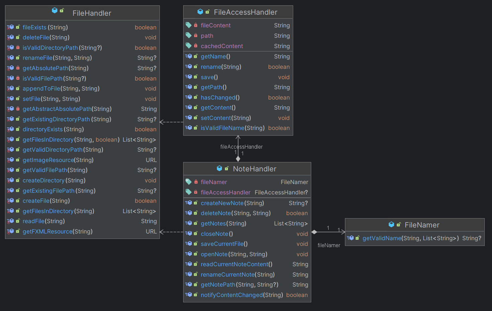

# Notetaker

Notetaker is a JavaFX application created as a school project. The application allows multiple users to log in to their secret notes, and create new, remove old, and rename and edit existing notes. You can either create your own user, or log in with the existing username `leif` and password `password`.

The application has automatic rename protection, which makes sure that the files don't overwrite each-other, and automatic naming, which makes sure that creating a new file will always result in it picking a name that hasn't been taken.

The application has manual saving, which means that the user has to save the file manually. This is done to make sure that the user is aware of what they are doing.

The user can create as many notes as they want, which will be password protected and seperated from other users. And if the user has a note with the same name as another user, the application will automatically rename the file to avoid overwriting. If the user wants to delete a note, they can do so by clicking the red delete button on the note.


*This is an ER diagram of the classes used while a user is logged in*

## Features

- Multiple users
- Creation of new users
- Password protected notes
- Creation and deletion of notes
- Renaming and editing of notes

## Run Locally

Clone the project

```bash
git clone https://github.com/leifssm/notetaker
```

Go to the project directory

```bash
cd notetaker
```

Run the project

```bash
mvn javafx:run
```

## Running Tests

To run tests, run the following command

```bash
mvn test
```

## Appendix

For the task, the students had to also answer the following questions:

### Hvilke deler av pensum i emnet dekkes i prosjektet, og på hvilken måte?
I prosjektet har flere konsepter fra pensum blitt tatt i bruk, blant annet arv, interface og delegering. Disse prinsippene har vært med på å strukturere koden på en forståelig og vedlikeholdbar måte, samtidig som de har gjort det enklere å skille ansvar og legge til nye funksjoner ved behov.

Bruk av arv finner vi i klassen `LoginError`, som utvider `Exception`. Dette gjør det mulig å definere egne tilpassede feilmeldinger relatert til innlogging, og gjør de lette å bruke i f.eks. en try-catch blokk for å skille mellom forventede feilmeldinger og systemfeil. Et annet eksempel er NoteItem, som arver fra BorderBox. Ved å bruke arv her, gjenbrukes eksisterende komponenter, samtidig som det gis mulighet til å utvide og tilpasse dem på en effektiv måte.

Interface brukes blant annet i `UserProvider`. Dette interfacet gjør det mulig for den å bli brukt i bl.a. foreach løkker. `UserProvider` lar andre deler av applikasjonen lese brukerinformasjon uten å bry seg om den konkrete implementasjonen. Dette bidrar til løs kobling mellom komponentene og gjør koden mer fleksibel og lettere å teste.

Delegering blir brukt her og der, men er spesielt i controller-klassene, som etter MVC-prinsippet unngår å inneholde for mye logikk. I stedet delegeres det meste av arbeidet til modellene. Dette gjør controllerne lettere å forstå og vedlikeholde. Et annet godt eksempel på delegering er `NoteHandler`, som gir ansvaret for lagringshåndtering av filer videre til FileAccessHandler (som igjen delegerer selve filhåndteringen til `FileHandler`). Dette gir en tydelig arbeidsfordeling og sørger for at hver klasse har ett tydelig ansvar.

### Dersom deler av pensum ikke er dekket i prosjektet deres, hvordan kunne dere brukt disse delene av pensum i appen?

Selv om mye av pensum er brukt i prosjektet, finnes det også enkelte elementer som ikke ble tatt i bruk. For eksempel ble ikke instanceof-operatoren brukt. Comparable ble heller ikke brukt, da det ikke var nødvendig å sortere objekter i det omfanget prosjektet krevde. Hvis disse skulle blitt brukt så hadde det vært mulig å implementere forskjellige sorteringsmoduser, for eksempel hvis brukeren hadde hatt lyst til å sortere etter navn eller dato. 

Jeg brukte heller ikke `InputStream`/`OutputStream`s ettersom at jeg ikke så behov for å håndtere de direkte. Jeg brukte derimot `PrintWriter`, som fungerte som et mellomledd for bruk av `OutputStreamWriter`. Hvis jeg derimot hadde hadd behov for en mer finkontroll over hva som ble skrevet eller lest så kunne det vært hensiktsmessig å bruke disse.

### Hvordan forholder koden deres seg til Model-View-Controller-prinsippet?

Jeg har fulgt Model-View-Controller-arkitekturen i applikasjonen. 'models' står for den underliggende logikken og databehandlingen, 'views' består av brukergrensesnitt-komponenter, og 'controllers' fungerer som mellomledd som håndterer kommunikasjonen mellom de to. For at applikasjonen best mulig skulle følge MVC arkitekturen så  prøvde jeg å passe på at mest mulig av logikken ble lagt i modellene, og at kontrollerne primært skulle koordinere. Dette ble gjort for å gjøre koden lettere å vedlikeholde og teste.


### Hvordan har dere gått frem når dere skulle teste appen deres, og hvorfor har dere valgt de testene dere har? Har dere testet alle deler av koden? Hvis ikke, hvordan har dere prioritert hvilke deler som testes og ikke?

Ikke alle deler ble testet i applikasjonen for å spare tid, men de områdene som er best krisisk ble testet. De områdene som det trengtes det mest var hovedsakelig filhåndteringen ettersom at det er der hovedfunksjonaliteten til programmet ligger, og filnavngiving ettersom at det er der all brukerinputen blir håndtert og må saniteres for å sikre en god brukeropplevelse.

Vi valgte derimot å ikke bruke mye tid på å teste javafx komponenter fordi det var forventet at javafx skulle fungere uten feil. Kontrollerne ble heller ikke testet fordi disse i stor grad består av koblinger mellom modell og visning, og inneholder lite egen logikk. Feil her ville uansett bli tydlige gjennom bruk av applikasjonen, og funksjonaliteten til applikasjonen blir testet i modellene.